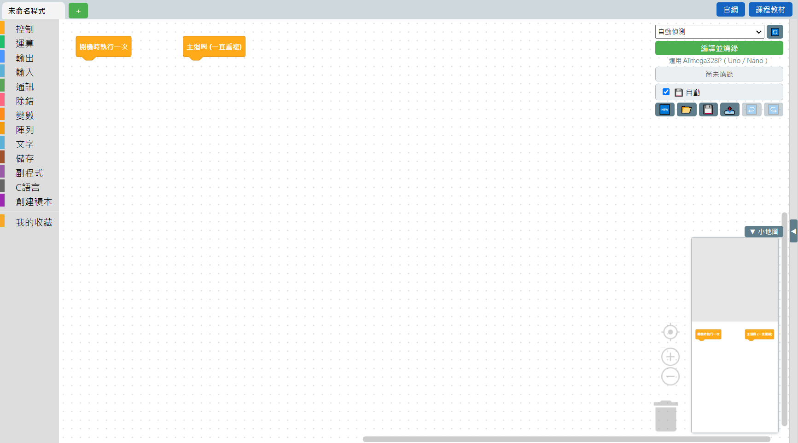

# 1.2 第一次開啟軟體

打開軟體之後，你會看到這樣的畫面：

先不用怕，這個畫面雖然按鈕不少，但每一區都有固定的用途。這裡先快速認識五個大區塊，每一區詳細的介紹在下一章 [軟體介面導覽](../02-軟體介面導覽/00-總覽.md)：

1. **左邊：積木分類欄** —— 所有積木依照功能分類放在這裡，點一下分類名稱就會展開該類的積木。
2. **中間：畫布** —— 從左邊拖積木出來、組合成你的程式的地方。一開始就會有「開機時執行一次」跟「主迴圈」兩顆積木在畫布上，這是每個程式都需要的骨架。
3. **右上角：工具列** —— 選擇連接埠、按下去編譯燒錄、存檔開檔的按鈕都在這裡。
4. **右側（預設收起來）：C++ 程式碼預覽** —— 你拖的積木會即時轉換成真正的 C++ 程式碼，點右上角的 `▶` 箭頭可以展開來看。
5. **右下角：小地圖** —— 當程式積木很多、畫布捲來捲去容易迷路時，這個縮圖可以幫你快速跳到想看的位置。

💡 **小提醒**：畫布上的「開機時執行一次」和「主迴圈」**每個程式只能各放一顆**，這是刻意的設計——放兩顆看起來像是兩段程式同時執行，但目前的板子做不到「同時做兩件事」，放兩顆只會讓人誤會，所以軟體會擋下來。

---
上一步：[1.1 安裝軟體](01-安裝軟體.md)　｜　下一步：[1.3 第一個程式：LED 閃爍](03-第一個程式-LED閃爍.md)
