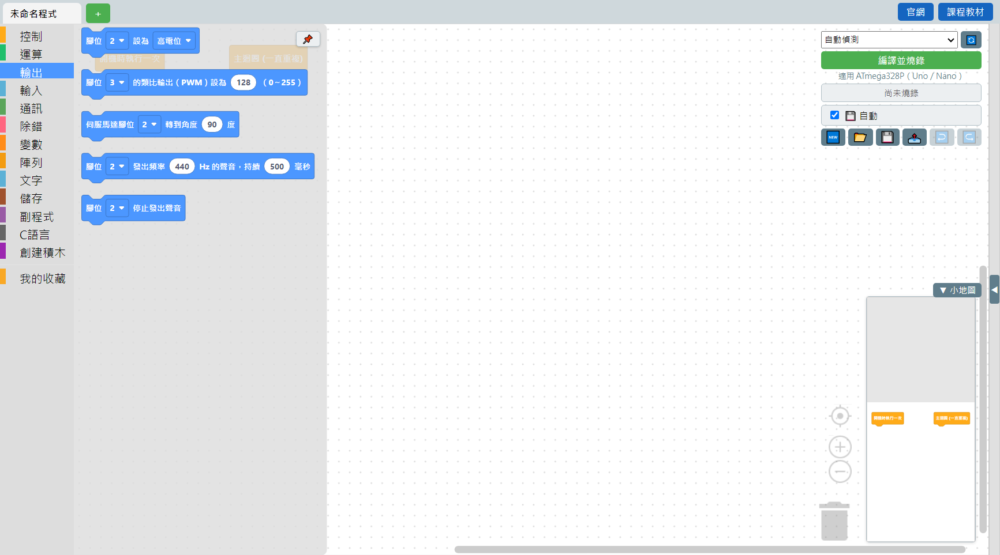
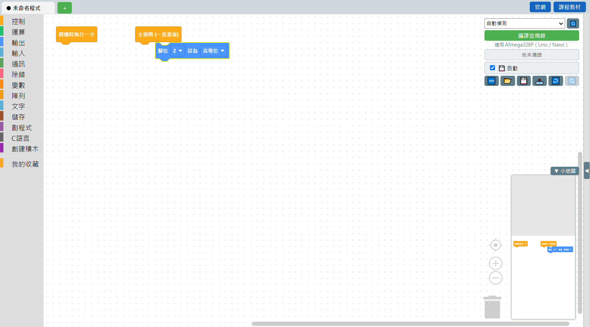
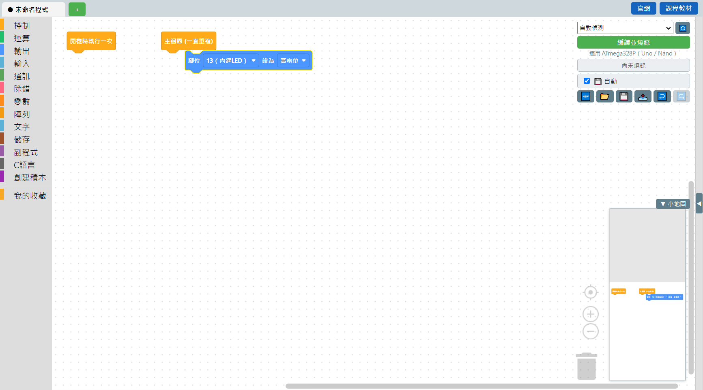
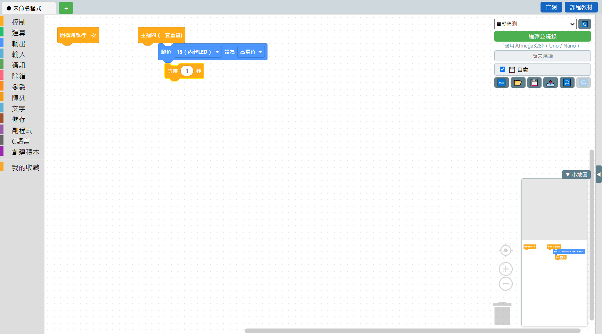
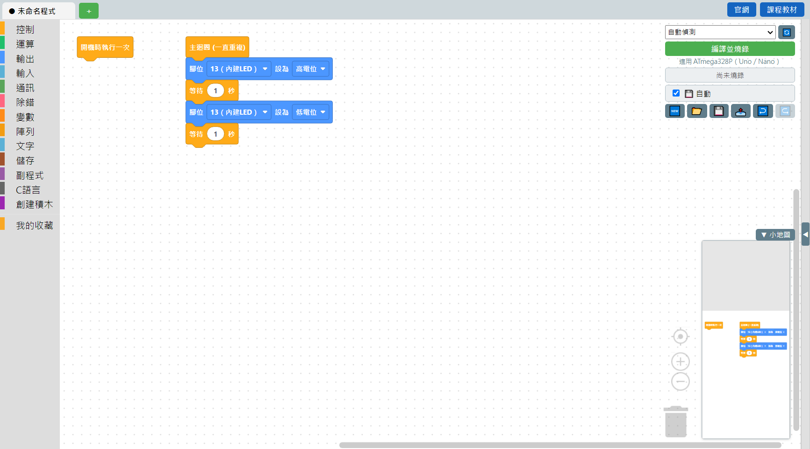
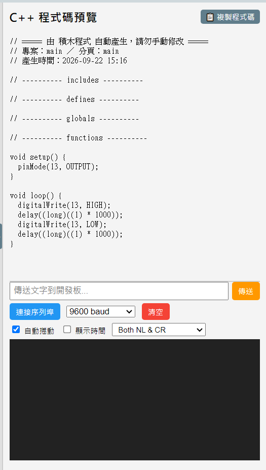

# 1.3 第一個程式：LED 閃爍

這是最經典的入門練習：讓板子上內建的小燈一亮一暗、不斷閃爍。

⚠️ **這個範例只適用 Arduino Uno 或 Nano 開發板**（或相容的 CH340 版 Nano）。這兩種板子上都有一顆焊在板子上的內建 LED，固定接在第 13 號腳位，不用另外接線就能用。**如果你用的是其他型號的開發板，不一定有這顆內建 LED、或是接在別的腳位**，需要另外查你手上那片板子的資料。目前 MBC 圖控編程也只支援 Uno / Nano 這類 ATmega328P 晶片的板子（詳見[燒錄與疑難排解](../06-燒錄與疑難排解/07-目前只支援ATmega328P.md)）。

## 步驟一：打開「輸出」分類

點左邊積木分類欄的**輸出**（藍色那個），會展開這一類的積木：

## 步驟二：把「腳位設為」拖進主迴圈

從展開的積木欄裡，把「**腳位 ▾ 設為 ▾**」這顆積木拖到畫布上「**主迴圈 (一直重複)**」積木的下面，兩顆靠近時會出現插槽提示，放開滑鼠就會接上去：

## 步驟三：選擇腳位

點積木上的腳位下拉選單，選成 **13（內建LED）**：

「設為」後面那個下拉選單維持預設的**高電位**就好——高電位＝通電＝燈亮。

## 步驟四：加上「等待」

打開**控制**分類，把「**等待 ▾ 秒**」拖到剛剛那顆積木下面接起來：

## 步驟五：再接一組「熄滅、等待」

重複步驟二到四，再接一顆「腳位設為」（這次下拉選單選**低電位**＝斷電＝燈暗），後面再接一顆「等待 1 秒」。完成後應該長這樣：

## 步驟六：看看產生的程式碼

點右上角程式碼預覽區的 `▶` 箭頭展開，可以看到積木自動幫你寫好的 C++ 程式碼：

完全不用手動打字，`pinMode`、`digitalWrite`、`delay` 這些指令都是積木自動組出來的。

## 步驟七：燒錄到板子上

1. 用 USB 傳輸線把 Arduino Uno 或 Nano 接上電腦。
2. 右上角連接埠下拉選單維持「**自動偵測**」就好（找不到板子的話看[燒錄與疑難排解](../06-燒錄與疑難排解/README.md)）。
3. 點綠色的「**編譯並燒錄**」按鈕，等進度條跑完。
4. 看板子上那顆小燈是不是開始一亮一暗閃爍了！

---
上一步：[1.2 第一次開啟軟體](02-第一次開啟軟體.md)　｜　下一步：[1.4 板子插上沒反應？先裝 USB 驅動](04-安裝USB驅動程式.md)
