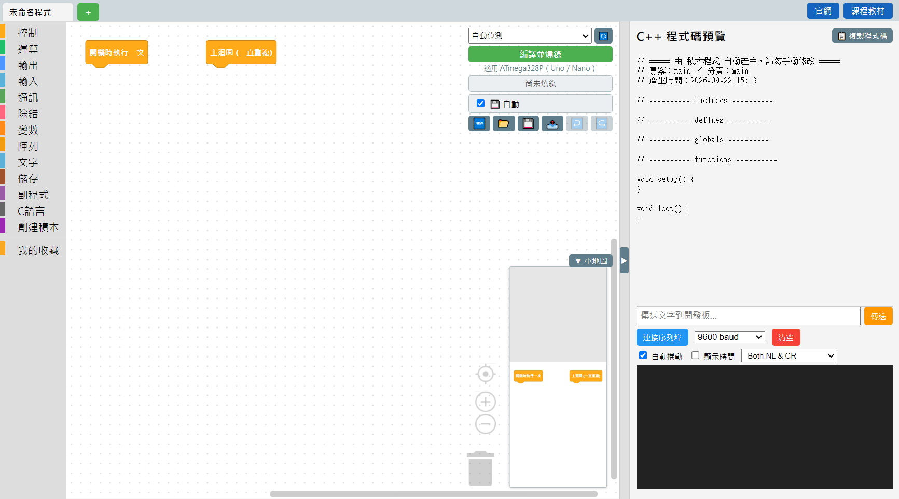

# 二、軟體介面導覽

這一章把畫面上每一個區塊都拆開來介紹。展開程式碼預覽區之後，完整畫面長這樣：

點下面任一個章節，看該區塊詳細怎麼用：

1. [2.1 左側積木分類欄](01-積木分類欄.md) —— 積木都放在這裡，依功能分類
2. [2.2 中間畫布](02-畫布.md) —— 組合積木、寫程式的地方
3. [2.3 右上角工具列](03-工具列.md) —— 連接埠、燒錄、存檔
4. [2.4 C++ 程式碼預覽](04-程式碼預覽.md) —— 即時看到積木轉成的程式碼
5. [2.5 序列埠監控](05-序列埠監控.md) —— 跟板子互相傳送文字
6. [2.6 小地圖](06-小地圖.md) —— 畫布縮圖導覽
7. [2.7 分頁列](07-分頁列.md) —— 同時開好幾個程式
8. [2.8 積木搜尋](08-積木搜尋.md) —— 積木太多找不到時用

---
接下來：[三、積木操作技巧](../03-積木操作技巧/README.md)
