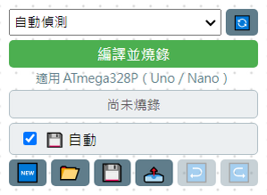

# 2.3 右上角工具列

右上角這一整條，由上到下依序是：

1. **連接埠下拉選單**（含 🔄 重新整理）—— 選擇要燒錄到哪個 USB 埠。「自動偵測」會自己找板子；如果同時接了好幾個 USB 裝置、或自動偵測找錯，可以從這裡手動選。
2. **編譯並燒錄**（綠色大按鈕）—— 按下去就會把畫布上的積木轉成程式碼、編譯、燒錄進板子。按下去的同時，右邊的程式碼預覽區會自動展開，讓你看到目前進度；燒錄成功後會自動收起來。
3. **適用 ATmega328P（Uno／Nano）**提示文字 —— 提醒目前這個版本只支援哪些板子。
4. **燒錄狀態列**（「尚未燒錄」／「已燒錄」等）—— 告訴你板子上現在燒的是不是畫布上目前這份程式。
5. **自動（勾選框）** —— 勾起來的話，軟體每隔一段時間會自動幫你存檔，不用自己按 Ctrl+S。
6. **六顆快捷圖示**：由左到右依序是「新增分頁」「開啟」「存檔」「另存新檔」「上一步」「下一步」。

## 燒錄成功之後

板子上會實際跑起你的程式；如果有用到 `序列埠印出` 之類的積木，可以打開 [序列埠監控](05-序列埠監控.md) 看板子傳回來的文字。

## 燒錄失敗、找不到板子？

看 [燒錄與疑難排解](../06-燒錄與疑難排解/README.md) 章節，裡面有完整的排查步驟。

---
上一步：[2.2 中間畫布](02-畫布.md)　｜　下一步：[2.4 C++ 程式碼預覽](04-程式碼預覽.md)
