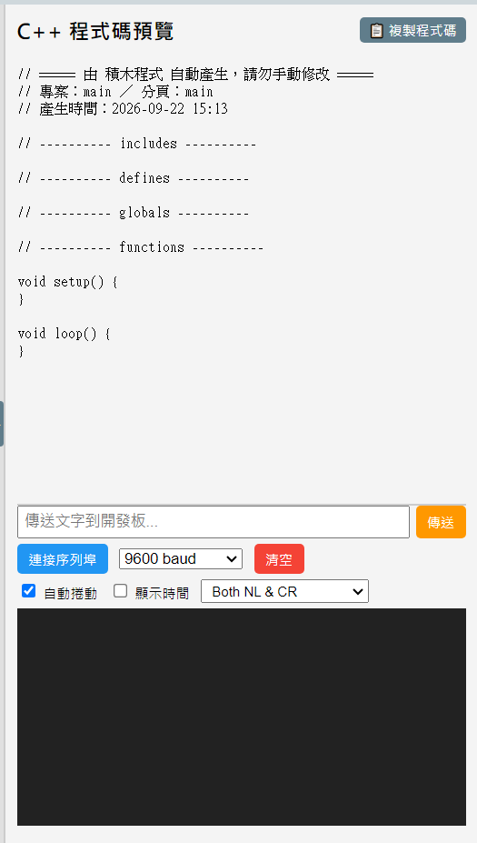

# 2.4 C++ 程式碼預覽

軟體一開啟時，這個區域預設是收起來的，讓畫布有更大的空間。點分隔線上的 `▶` 箭頭、或按下「編譯並燒錄」，就會自動展開：

## 這區在做什麼

畫布上的積木，其實**背後都對應著真正的 C++ 程式碼**——這個區域即時把你拖的積木轉換成 Arduino 看得懂的程式碼，讓你（或程度比較好的學生）可以順便學到真正的程式語法，不是只停留在拖積木的層次。

- **拖曳左邊的分隔線**可以調整這區的寬度。
- 點右上角的「**📋 複製程式碼**」可以把目前的程式碼整段複製到剪貼簿。
- **點程式碼裡的某一行**，畫布上對應的積木會自動被找出來、框起來，方便對照。

## 燒錄錯誤時會顯示在這裡

如果編譯失敗（例如積木還沒接好、參數沒填），下方會出現紅色的錯誤說明區塊，盡量用白話中文解釋錯誤原因，並且**自動把有問題的那顆積木在畫布上標示出來**。

如果完全找不到板子（沒插、驅動沒裝），這裡會出現一張圖解，教你三個檢查步驟，也有一顆「安裝 USB 驅動程式」的按鈕可以直接點。

---
上一步：[2.3 右上角工具列](03-工具列.md)　｜　下一步：[2.5 序列埠監控](05-序列埠監控.md)
