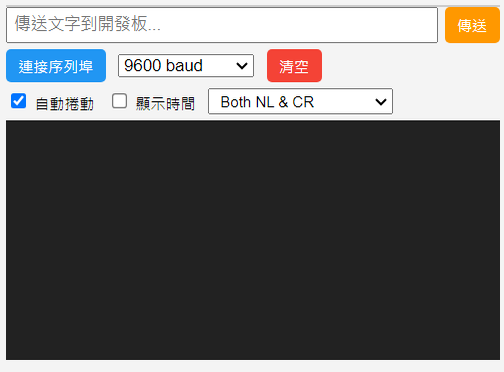

# 2.5 序列埠監控

程式碼預覽區的下半部是序列埠監控，可以讓電腦跟板子之間**互相傳送文字**，是除錯（看程式跑到哪裡、變數的值是多少）最常用的工具：

## 怎麼用

1. 確定積木裡有用到「通訊」分類的序列埠積木（例如「序列埠印出」）。
2. 燒錄成功後，軟體會自動幫你連上序列埠；也可以自己按「**連接序列埠**」按鈕手動連線。
3. 板子傳回來的文字會顯示在黑色的視窗裡。
4. 下方輸入框可以打字、按「**傳送**」送到板子上（板子端要有對應的「讀取序列埠文字」積木才收得到）。

## 其他設定

- **鮑率**（baud rate）下拉選單：要跟積木裡「設定序列埠速度」用的數字一致，不然收到的文字會變成亂碼，預設 9600 通常不用改。
- **清空**：把目前顯示的內容清掉。
- **自動捲動**：勾起來的話畫面會自動捲到最新一行，不用自己往下拉。
- **顯示時間**：每一行前面加上收到的時間戳記。

---
上一步：[2.4 C++ 程式碼預覽](04-程式碼預覽.md)　｜　下一步：[2.6 小地圖](06-小地圖.md)
