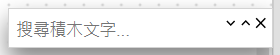

# 2.8 積木搜尋

程式越寫越大、積木越來越多之後，想找某一顆特定的積木可能要捲很久。這時候可以用積木搜尋：

## 怎麼打開

- 按快捷鍵 **Ctrl+F**，或是
- 上方選單「**編輯**」→「**積木搜尋**」

輸入積木上的文字關鍵字（例如「腳位」），畫布上符合的積木會被找出來並反白，右邊 `˅` `˄` 箭頭可以在多個結果之間切換，`x` 關閉搜尋列。

---
上一步：[2.7 分頁列](07-分頁列.md)　｜　接下來：[三、積木操作技巧](../03-積木操作技巧/README.md)
