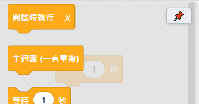
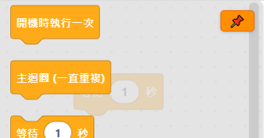

# 3.2 積木欄圖釘

軟體預設的行為是：拖一顆積木出來、點畫布空白處、點畫布上的積木，積木箱都會自動收起來——這是為了不擋住畫布。但如果要連續從同一個分類拉好幾顆積木，一直收起來、一直要重新點開分類反而麻煩。這時候可以用積木箱右上角的圖釘。

## 怎麼用

點一下積木箱右上角的圖釘 📌，圖釘會變成橘色，代表已經釘住：

釘住之後：

- 拖積木出來、點畫布空白處、點畫布上的積木——這幾種**都不會**讓積木箱自動收起來了。
- 再點一次同一個分類，積木箱還是會收起來（這是你自己明確要收的，不算「自動收」）。
- 再按一次圖釘可以取消釘住，恢復原本的自動收合行為。

## 小提醒

釘住狀態只在這次開著軟體的期間有效，**不會記住到下次開啟**——每次重新打開軟體，圖釘都會回到「沒釘住」的預設狀態。這是刻意設計的：釘住通常是「我現在要連續拉很多積木」的臨時需求，不是每次都要的習慣。

---
上一步：[3.1 拖、接、拔：積木怎麼連在一起](01-拖接拔基本操作.md)　｜　下一步：[3.3 選取積木](03-選取積木.md)
