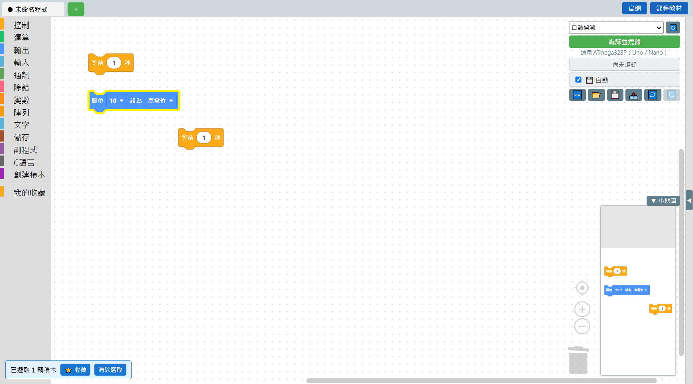

# 3.3 選取積木

想要一次複製、收藏、刪除好幾顆積木，要先把它們「選取」起來。選取的積木會有黃色外框，畫面左下角會跳出選取工具列，告訴你選了幾顆、可以做什麼：

## 選取的方式

| 操作 | 效果 |
|---|---|
| 直接點一顆積木 | 只選這一顆，取消原本選的其他積木 |
| **Ctrl** ＋點一顆積木 | 加選這一顆，原本選的維持不變 |
| **Shift** ＋在畫布空白處拖曳 | 框選：拖出一個矩形框，框到的積木全部被選起來 |
| 點畫布空白處 | 取消所有選取 |
| 選取工具列的「清除選取」按鈕 | 效果跟點空白處一樣，用按鈕比較不會不小心點到積木 |

## 選取之後能做什麼

選取工具列會直接顯示可以做的動作：

- ⭐ **收藏**——把選取的積木存進[收藏區](04-積木收藏區.md)，之後任何專案都能拉出來用。
- **清除選取**——取消目前的選取狀態。

選取起來之後，也可以搭配鍵盤：`Ctrl+C` 複製、`Delete` 刪除、`Ctrl+X` 剪下（詳見 [3.5 複製貼上](05-複製貼上.md)、[3.8 Windows 慣用鍵](08-Windows慣用鍵.md)）。

## 小提醒

如果選取的積木裡用到某個變數，但**宣告這個變數的積木不在選取範圍內**（例如變數是在一個「重複 N 次」迴圈裡宣告的，你卻只選了迴圈裡面的一部分），複製這個選取範圍時軟體會提醒你：要把整個宣告變數的迴圈或副程式一起選起來，才能正確複製——這是為了避免複製出去的積木用到「不存在的變數」。

---
上一步：[3.2 積木欄圖釘](02-積木欄圖釘.md)　｜　下一步：[3.4 積木收藏區](04-積木收藏區.md)
