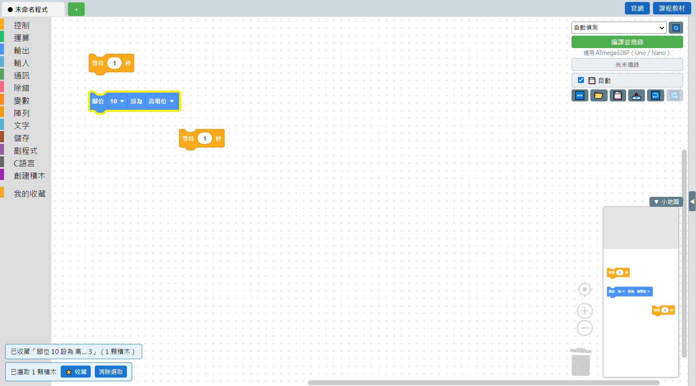
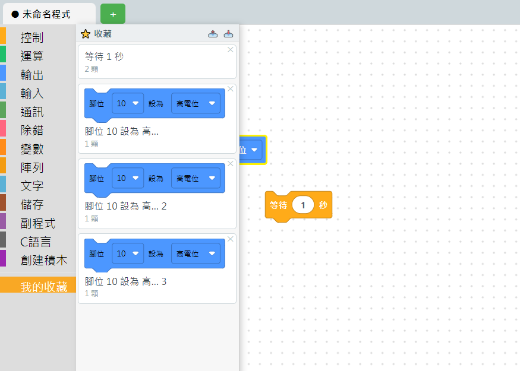

# 3.4 積木收藏區

常常要重複排同一串積木嗎？例如你自己固定的「初始化感測器」那幾顆積木、或是常用的一段邏輯——可以把它收藏起來，之後在**任何專案、任何分頁**都能直接從積木箱拉出來用，不用每次重新排一次。

## 怎麼收藏

1. 先照 [3.3 選取積木](03-選取積木.md) 選好要收藏的積木。**一次只能收藏「一串」**——如果選到兩串分開的積木（彼此沒有接在一起），按收藏會被擋下來並提醒你，因為拖出來的時候軟體不知道要怎麼表達「一半、一半」的東西。
2. 按選取工具列上的「⭐ 收藏」按鈕。
3. 收藏成功會跳出提示，例如：「已收藏『腳位 10 設為 高...』（1 顆積木）」。

## 收藏區長什麼樣子

積木分類欄最下面會有一個「我的收藏」分類，點下去會像其他分類一樣彈出收藏清單，但版面比較大、每一項都有縮圖：

- 每張卡片顯示收藏時的名稱（取自積木內容自動命名）跟包含幾顆積木。
- 卡片右上角的 ✕ 可以刪除這個收藏項目。
- 直接把卡片拖到畫布上，就會複製一份出來，跟拖一般積木一樣。
- 面板上方的 📤／📥 可以把整個收藏集匯出成檔案（例如發給別的老師、或帶到別台電腦），📥 匯入時是**合併**，不會蓋掉原本已經有的收藏。

## 小提醒

收藏區存在使用者資料夾（不是存在某個專案檔案裡），所以**開新專案、開別人做的專案，收藏區的內容都還在**——這是設計成「老師個人的工具箱」，不是跟著單一專案走的東西。

---
上一步：[3.3 選取積木](03-選取積木.md)　｜　下一步：[3.5 複製貼上](05-複製貼上.md)
