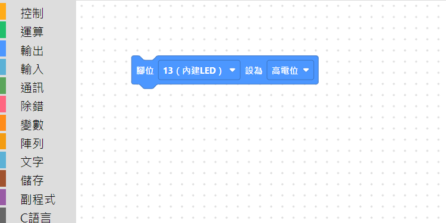
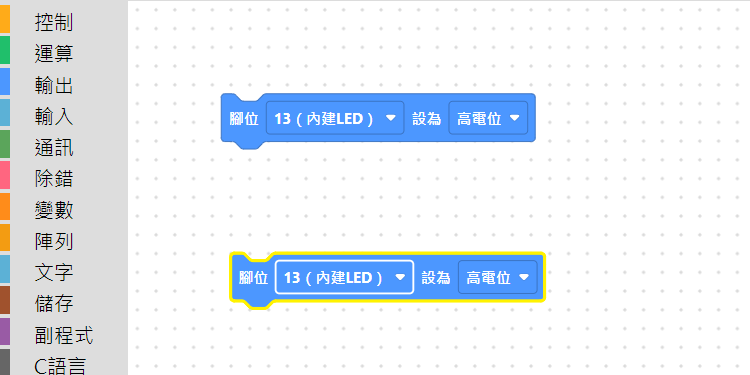

# 3.6 Ctrl+拖曳快速複製

不想按 `Ctrl+C`／`Ctrl+V` 兩個步驟的話，還有更快的一招：**按住 Ctrl 直接拖曳積木**，放開滑鼠的時候原本那顆積木會留在原地，多出一份一模一樣的拖到新位置。

拖曳前，畫布上只有一顆「腳位 13 設為高電位」：

按住 Ctrl、從這顆積木往下拖一段距離放開，原本那顆留在原位，多了一份複製出來的：

## 小提醒

- 這個動作等同「先 `Ctrl+C`，再 `Ctrl+V` 選好位置放下」的濃縮版，跳過了選單，一個拖曳動作就完成。
- **拖曳開始的時候就要按著 Ctrl**（不是拖到一半才按）。如果是 `Ctrl+V` 之後 Ctrl 還沒放開就接著操作，可能會被誤判成想再複製一次，養成「按住 Ctrl 開始拖、放開滑鼠後再放開 Ctrl」的習慣比較不會混淆。
- 如果選了好幾顆積木（見 [3.3 選取積木](03-選取積木.md)）再按住 Ctrl 拖曳，會整組一起複製。

---
上一步：[3.5 複製貼上](05-複製貼上.md)　｜　下一步：[3.7 上一步／下一步](07-上一步下一步.md)
