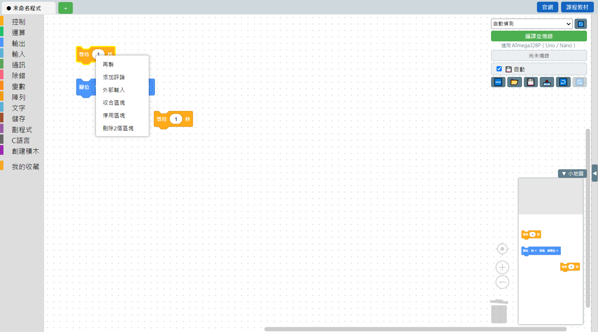
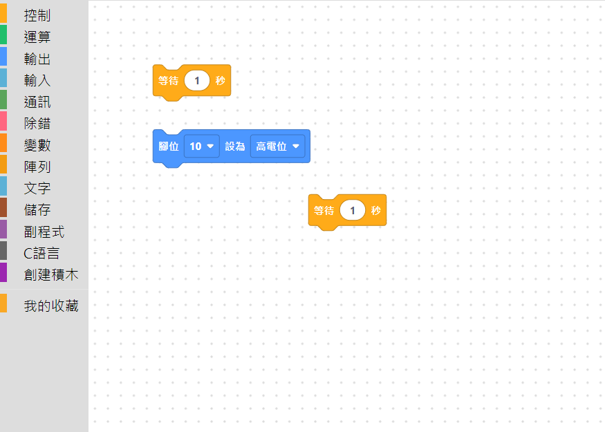
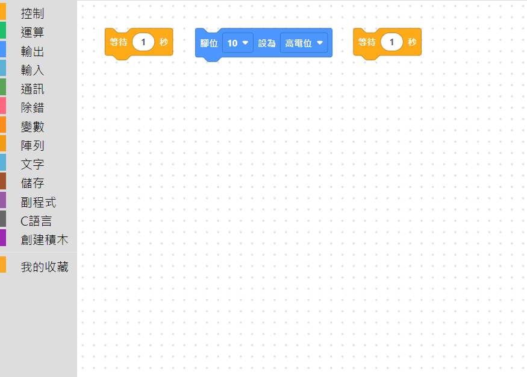

# 3.9 整理積木與右鍵選單

在任何一顆積木上按右鍵，會跳出這顆積木可以做的動作：

| 選項 | 說明 |
|---|---|
| 再製 | 原地複製一份一模一樣的積木（等同 [3.6 Ctrl+拖曳複製](06-Ctrl拖曳複製.md)，但不用拖，直接原地多一份） |
| 添加評論 | 幫這顆積木加一個便利貼式的註解，方便自己或別人看懂這段在做什麼 |
| 外部輸入／行內輸入 | 切換這顆積木裡面的插槽要「橫向排」還是「往下折疊」顯示，純粹是排版偏好，不影響功能 |
| 收合區塊／展開區塊 | 把這顆積木（跟它接的所有積木）收成一條窄窄的長條，暫時眼不見為淨，之後可以再展開。適合先把不想看到的一大段暫時收起來 |
| 停用區塊／啟用區塊 | 停用後這顆積木會變成灰色，**編譯的時候會被跳過，不會產生程式碼**，但積木本身還留在畫布上——很適合「先試試看拿掉這段會怎樣」，不用真的刪掉再重排 |
| 刪除 N 個區塊 | 把這顆積木跟它接的所有積木一起刪除，選單會先告訴你總共會刪掉幾顆 |

> 💡 在畫布**空白處**按右鍵，選單會不一樣，是整個畫布層級的動作（例如整理積木）。

## 整理積木（一鍵排版）

畫布上的積木東一顆西一顆，可以在畫布空白處按右鍵選「整理積木」，軟體會自動把所有積木排整齊。整理前：

整理後，全部對齊排好：

這個動作**只會影響積木的排列位置，不會改變積木的內容或連接關係**，可以放心用，畫面亂了隨時整理一下。

---
上一步：[3.8 Windows 慣用鍵](08-Windows慣用鍵.md)　｜　下一步：[3.10 跨分頁搬移積木](10-跨分頁搬移積木.md)
