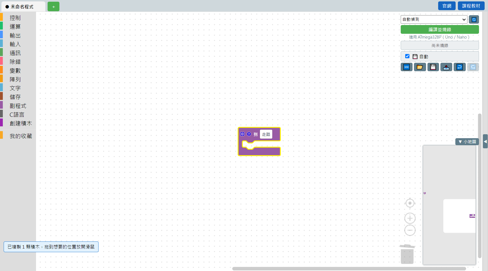

# 3.11 雙擊跳到副程式定義

程式排得大、[副程式](../04-積木字典/11-副程式.md)呼叫積木跟它的定義離得很遠的時候，想知道「這個副程式到底寫了什麼」，不用自己在畫布上慢慢找——**在副程式的呼叫積木上快速點兩下**（雙擊），畫面會自動捲動、置中到這個副程式定義的位置，並且把定義積木框起來，一眼就能看到。

例如下面有一顆呼叫「走路」的積木，它的定義放在畫布很遠的地方：

雙擊之後，畫面直接捲動到定義積木「到 走路」的位置，並且用黃色外框標示出來。

## 小提醒

- 這個功能只對**呼叫積木**有效（雙擊定義積木本身沒有作用）。
- 雙擊的判定是「500 毫秒內、位置沒有明顯移動」的兩次點擊，跟一般軟體的雙擊手感一致。
- 這對排查「這個副程式到底做了什麼」特別有用，尤其是積木包裡帶來的、你自己沒寫過的副程式。

---
上一步：[3.10 跨分頁搬移積木](10-跨分頁搬移積木.md)　｜　回到：[積木操作技巧總覽](README.md)
