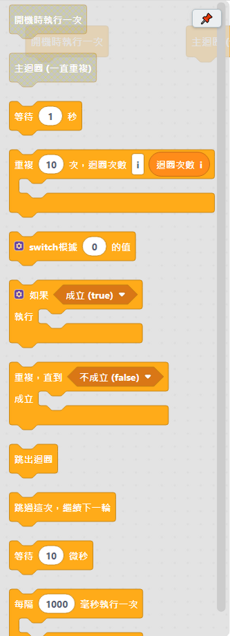
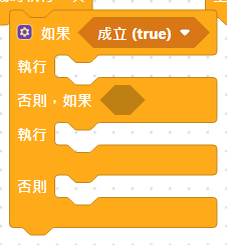
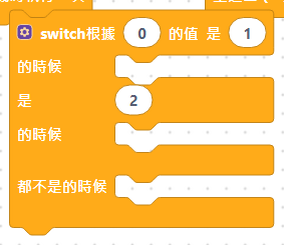

# 4.1 控制類

控制迴圈流程、等待時間、條件判斷用的積木。這一類的積木是搭「程式骨架」最常用的。

## 基本流程積木

| 積木 | 說明 |
|---|---|
| 開機時執行一次 | 板子通電時最先且只執行一次。通常用來做初始化。**每個程式只能放一顆**，積木箱裡變成灰色就表示已經放過了。 |
| 主迴圈（一直重複） | 開機執行一次的部分做完後，這裡的程式會一直不斷重複執行。**每個程式只能放一顆**——放兩顆看起來像兩段程式會同時跑，但板子目前做不到（還沒有分時多工），反而會誤導。 |
| 等待 ___ 秒 | 停下來等一段時間，時間到才做下一個積木。 |
| 等待 ___ 微秒 | 停下來等一小段時間（微秒＝百萬分之一秒），比「等待…秒」更短更精細。常用在超音波感測器這類需要精準短暫訊號的地方。 |

這三顆積木長什麼樣子，可以參考 [1.3 第一個程式：LED 閃爍](../01-快速開始/03-第一個程式-LED閃爍.md)，裡面就是拿「開機時執行一次」「主迴圈」「等待…秒」搭出來的。

## 迴圈積木

| 積木 | 說明 |
|---|---|
| 重複 ___ 次 | 裡面的積木會重複做指定的次數。右邊有一顆「迴圈次數 i」可以拖出來用，就能在迴圈裡讀出目前是第幾次（從 0 開始數）。i 可以改成別的字，但前面的「迴圈次數」文字不會跟著變。 |
| 重複，直到 ___ 成立 | 每次都先檢查條件，還沒成立就做一次裡面的積木，直到條件成立為止。 |
| 每隔 ___ 毫秒執行一次 | 每隔一段時間做一次裡面的積木，但不會像「等待」那樣卡住整個程式——可以一邊做這個、一邊繼續做外面其他的積木（例如一邊每秒閃一次燈，一邊持續讀按鈕）。 |

### 「重複 ___ 次」搭配迴圈次數使用

把積木右邊的「迴圈次數 i」拖進迴圈裡面，就能知道現在跑到第幾次：

## 迴圈裡才能用的積木

| 積木 | 說明 |
|---|---|
| 跳出迴圈 | 立刻結束整個迴圈，不管迴圈原本的次數／條件有沒有到，直接跳到迴圈後面繼續。**要放在「重複」「重複，直到」這類迴圈積木裡面才有效**。 |
| 跳過這次，繼續下一輪 | 立刻跳過這一輪剩下的積木，直接開始迴圈的下一輪（不是結束整個迴圈，下一輪還是會繼續跑）。**要放在「重複」「重複，直到」這類迴圈積木裡面才有效**。 |

## 條件判斷積木

| 積木 | 說明 |
|---|---|
| 如果…執行 | 條件成立才做裡面的積木；不成立就跳過。點積木左上角的齒輪 ⚙️ 可以加「否則，如果」「否則」。 |
| switch 根據…的值 | 依照一個數值，分別跑不同的積木，等同好幾個「如果」串在一起，但比較整齊。點齒輪 ⚙️ 可以增加「是…的時候」的數量。 |

### 如果／否則，如果／否則（用齒輪 ⚙️ 展開）

齒輪符號可以增加「否則，如果」的數量，也可以加一個「否則」（都沒有符合的時候才做）。

### switch 積木（用齒輪 ⚙️ 展開）

跟「如果」不一樣的地方：switch 是拿同一個數值去比對好幾個可能的值（像是「模式是 1 的時候做這個、模式是 2 的時候做那個」），不用每個條件都重複寫一次「模式 = ...」。

---
上一步：[積木字典總覽](README.md)　｜　下一步：[4.2 運算類](02-運算.md)
