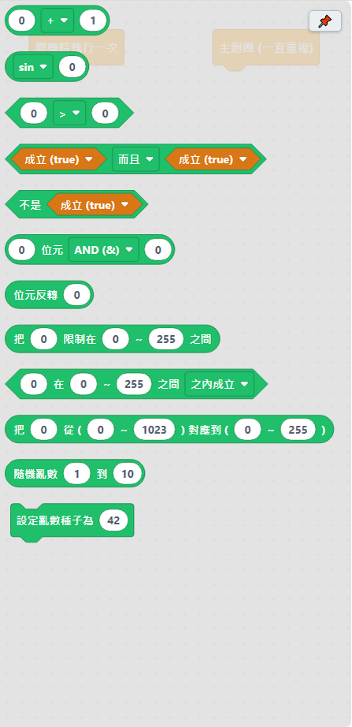

# 4.2 運算類

數學計算、比較大小、邏輯判斷用的積木，通常會接在其他積木「＿」的空格裡使用。

## 數學運算

| 積木 | 說明 |
|---|---|
| ＿ ＋－×÷ ＿ | 兩個數字的四則運算、取餘數、次方、比大小。**÷ 會保留小數**（例如 10÷3 得到 3.33，不會直接捨去變成 3）；餘數只適用於整數。 |
| sin／cos／√ 等 ＿ | 三角函數、開根號、絕對值。**角度用「度」計算**（跟數學課本一樣，不是電腦常用的弧度），例如 sin(30) 就是數學課本裡的 sin 30 度。 |

## 比較與邏輯

| 積木 | 說明 |
|---|---|
| ＿ ＝／＞／＜ ＿ | 比較兩邊的大小或是否相等（數字或文字都可以比較）。 |
| ＿ 而且／或者 ＿ | 組合兩個條件：「而且」要兩邊都成立，「或者」只要任一邊成立。 |
| 不是 ＿ | 條件不成立的時候才成立（把成立和不成立倒過來）。 |

## 進階：位元運算

| 積木 | 說明 |
|---|---|
| ＿ 位元 ＆／｜／左移／右移 ＿ | 位元運算：把兩個數字的二進位表示逐位元計算，或整體左移／右移幾個位元。**進階用法**，操作暫存器、省記憶體常用。 |
| 位元反轉 ＿ | 把數字的每一個二進位位元反過來（0 變 1，1 變 0）。 |

## 範圍與對應

這幾顆對處理感測器數值特別好用：

| 積木 | 說明 |
|---|---|
| 把 ＿ 限制在 ＿～＿ 之間 | 數值比最小值小就變成最小值，比最大值大就變成最大值，中間就維持原樣。 |
| ＿ 在 ＿～＿ 之間 | 判斷數值有沒有落在範圍裡面（包含最小值和最大值）。 |
| 把 ＿ 從（＿～＿）對應到（＿～＿） | 把一個數字從原本的範圍，等比例換算成另一個範圍的數字。**常用在把感測器讀到的數值換算成好用的範圍**，例如把類比腳位讀到的 0～1023 換算成 0～255 的 LED 亮度。 |

## 隨機亂數

| 積木 | 說明 |
|---|---|
| 隨機亂數 ＿ 到 ＿ | 產生一個隨機數字，範圍包含最小值和最大值。 |
| 設定亂數種子為 ＿ | 不設定的話，「隨機亂數」每次開機抽到的數字順序都一樣（不是真的隨機）。想要每次開機都不一樣，接一顆「類比腳位的數值」積木、選一支**沒接任何東西**的腳位進來當種子，通常放在「開機時執行一次」裡面。 |

---
上一步：[4.1 控制類](01-控制.md)　｜　下一步：[4.3 輸出類](03-輸出.md)
