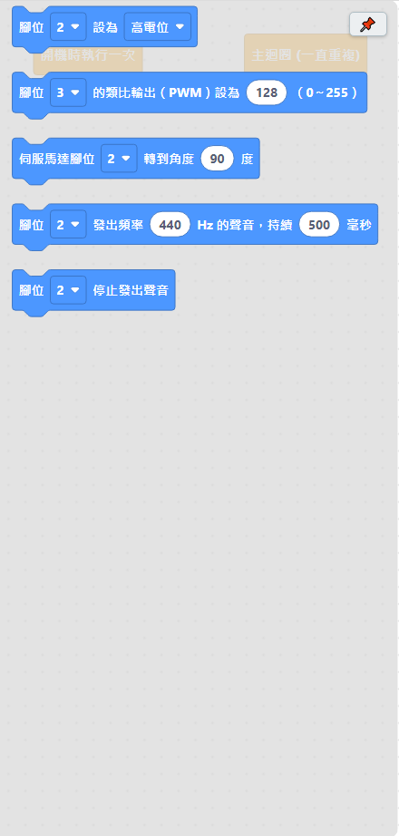

# 4.3 輸出類

控制板子腳位「輸出」東西：點亮 LED、轉馬達、發出聲音，都在這裡。

| 積木 | 說明 |
|---|---|
| 腳位 ＿ 設為 高電位／低電位 | 把腳位設為高電位（通電）或低電位（斷電）。接 LED 就是亮或暗。 |
| 腳位 ＿ 的類比輸出（PWM）設為 ＿（0～255） | 輸出 0～255 之間的類比訊號，可以用來控制 LED 亮度或馬達轉速。**只有標了 ~ 的腳位可以用**（Uno/Nano 是 3、5、6、9、10、11）。 |
| 伺服馬達腳位 ＿ 轉到角度 ＿ 度 | 控制伺服馬達轉到指定角度（0～180 度）。同一支腳位重複用同一顆伺服馬達即可。**注意**：使用伺服馬達的時候，腳位 9、10 的「類比輸出（PWM）」會受影響，盡量避免同時用。 |
| 腳位 ＿ 發出頻率 ＿ Hz 的聲音，持續 ＿ 毫秒 | 接一顆蜂鳴器或喇叭在這支腳位上，就會發出指定頻率（Hz，數字越大聲音越尖）的聲音，持續指定的毫秒數之後自動停止。 |
| 腳位 ＿ 停止發出聲音 | 提早停止這支腳位正在發出的聲音，不用等它自己持續完。 |

## 小提醒

- 「腳位設為高電位／低電位」是最基本的開關動作，LED 閃爍範例（[1.3](../01-快速開始/03-第一個程式-LED閃爍.md)）就是用這顆積木做的。
- PWM（類比輸出）不是每支腳位都能用，軟體會在腳位下拉選單裡幫忙標出可用的腳位。
- 伺服馬達要外接電源的話，記得馬達的地線（GND）要跟板子的 GND 接在一起，不然轉動會不穩。

---
上一步：[4.2 運算類](02-運算.md)　｜　下一步：[4.4 輸入類](04-輸入.md)
