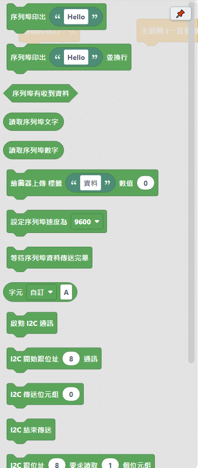

# 4.5 通訊類

跟電腦、或跟其他模組（感測器、顯示器）互相傳資料用的積木。

## 序列埠（跟電腦傳資料，最常用）

| 積木 | 說明 |
|---|---|
| 序列埠印出 ＿ | 在[序列埠監控視窗](../02-軟體介面導覽/05-序列埠監控.md)印出文字或數值，不會換行。 |
| 序列埠印出 ＿ 並換行 | 在序列埠監控視窗印出文字或數值，並換行。 |
| 序列埠有收到資料 | 當電腦有傳資料給板子時，這個積木會成立。 |
| 讀取序列埠文字 | 讀取電腦傳來的整串文字。 |
| 讀取序列埠數字 | 讀取電腦傳來的數字。 |
| 繪圖器上傳 標籤 ＿ 數值 ＿ | 上傳專門給序列繪圖器畫圖用的資料格式。 |
| 設定序列埠速度為 ＿ | 設定序列埠監控視窗的連線速度。**不放這顆積木的話，自動使用 9600**。放在哪裡都可以，只會影響整個程式的序列埠速度。 |
| 等待序列埠資料傳送完畢 | 停下來等，直到要傳給電腦的資料都真的送出去為止。 |
| 字元 ＿ | 產生一個字元（C 語言的 char）。常用的特殊字元（跳格、換行…）直接從下拉選單選；選「自訂」的話用旁邊的欄位打一個字元。 |

## I2C（接感測器、顯示器模組常用，只要 2 條線）

| 積木 | 說明 |
|---|---|
| 啟動 I2C 通訊 | 使用 I2C（也叫 Wire）跟其他模組通訊之前，要先放這顆積木啟動。很多感測器、顯示器模組都是用 I2C 通訊，**接線只要 2 條線**（SDA、SCL）。 |
| I2C 開始跟位址 ＿ 通訊 | 開始跟指定位址的 I2C 裝置通訊（位址要查該模組的說明書）。接下來用「I2C 傳送位元組」把要送的資料一個一個接上去，最後要記得用「I2C 結束傳送」收尾。 |
| I2C 傳送位元組 ＿ | 傳送一個位元組（0～255）的資料，要放在「I2C 開始跟位址…通訊」跟「I2C 結束傳送」中間，可以連續放好幾個。 |
| I2C 結束傳送 | 把剛剛用「I2C 傳送位元組」排隊的資料實際送出去，並結束這次通訊。 |
| I2C 跟位址 ＿ 要求讀取 ＿ 個位元組 | 跟指定位址的 I2C 裝置要求讀取指定個數的位元組。放這顆積木之後，接著用「I2C 還有資料可以讀嗎」配合「I2C 讀取一個位元組」把資料一個一個讀出來。 |
| I2C 還有資料可以讀嗎 | 配合「I2C 讀取一個位元組」用，通常放在「重複，直到…」或「如果」積木的條件裡，判斷資料有沒有讀完。 |
| I2C 讀取一個位元組 | 讀取一個剛剛用「I2C 跟位址…要求讀取」要到的位元組資料。 |

## SPI（比 I2C 快，SD 卡、部分顯示器常用）

| 積木 | 說明 |
|---|---|
| 啟動 SPI 通訊 | 使用 SPI 跟其他模組通訊之前，要先放這顆積木啟動。SPI 比 I2C 快，常見於 SD 卡模組、部分顯示器。**腳位是固定的**（Uno/Nano：10=SS、11=MOSI、12=MISO、13=SCK），不用另外設定。 |
| SPI 傳送位元組 ＿（同時收到對方回傳的位元組） | SPI 通訊一次傳送同時也會收到一個位元組。要自己另外用「腳位…設為 開/關」（[輸出類](03-輸出.md)）控制模組的 CS（片選）腳位，通訊前設為低電位、通訊後設回高電位。 |

---
上一步：[4.4 輸入類](04-輸入.md)　｜　下一步：[4.6 除錯類](06-除錯.md)
