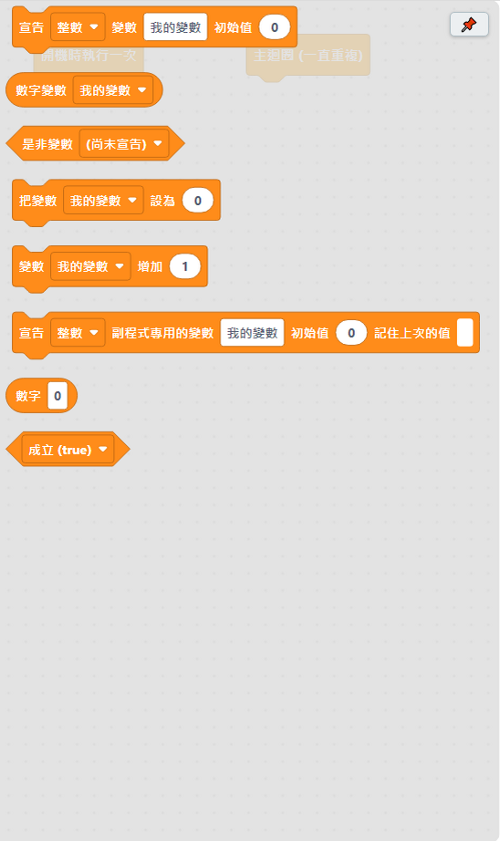

# 4.7 變數類

「變數」是拿來記住一個數字或是非值（true/false）的積木，像一個貼了名字標籤的箱子，裡面放的內容可以隨時換。

| 積木 | 說明 |
|---|---|
| 宣告 ＿ 變數 ＿ 初始值 ＿ | 建立一個變數，用來記住一個數字或文字。 |
| 數字變數 ＿ | 讀取這個數字變數目前的數值。下拉選單只會列出**站在這個位置看得到**的變數。 |
| 是非變數 ＿ | 讀取這個是非（布林）變數目前的數值。下拉選單只會列出站在這個位置看得到的變數。 |
| 把變數 ＿ 設為 ＿ | 改變這個變數的內容。下拉選單只會列出站在這個位置看得到的變數。 |
| 變數 ＿ 增加 ＿ | 把這個變數目前的值加上指定的數字（要減就填負數），等同於「變數 = 變數 + 數字」。**常用在計數**：每做一次就把次數增加 1。下拉選單只會列出站在這個位置看得到的數字變數。 |
| 宣告 ＿ 副程式專用的變數 ＿ 初始值 ＿ 記住上次的值 ＿ | 只有這個[副程式](11-副程式.md)裡面看得到這個變數，別的副程式不會互相影響，即使名字取得一樣也不會混在一起。勾選「記住上次的值」的話，下次呼叫這個副程式時會記得上次執行到哪裡；沒勾選的話，每次呼叫都會重新從初始值開始。**要放在副程式的積木堆疊裡面**（不要放在 if／重複 裡面），這樣副程式裡其他地方才都能用它。 |
| 數字 ＿ | 純數字，接在需要數字的空格裡。 |
| ＿（布林） | 布林值（成立／不成立），接在需要是非判斷的空格裡。 |

## 什麼是「站在這個位置看得到」

變數是在哪裡宣告的，就只有那個範圍看得到——在主迴圈外面宣告的變數，整個程式到處都看得到；在副程式裡面用「副程式專用的變數」宣告的，只有那個副程式自己看得到。下拉選單會自動過濾，只列出目前這個位置真的能用的變數，不會列出看不到的。

---
上一步：[4.6 除錯類](06-除錯.md)　｜　下一步：[4.8 陣列類](08-陣列.md)
