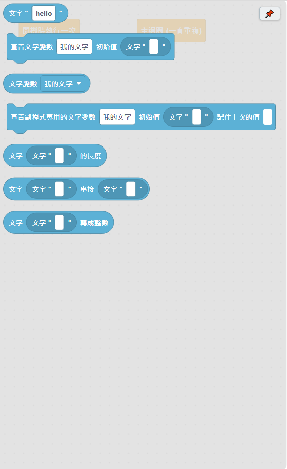

# 4.9 文字類

處理一整段文字（字串）用的積木。

| 積木 | 說明 |
|---|---|
| 文字 "＿" | 純文字，直接打在引號裡。 |
| 宣告文字變數 ＿ 初始值 ＿ | 建立一個字串變數，用來記住一段文字。 |
| 文字變數 ＿ | 讀取這個文字變數目前的內容。下拉選單只會列出站在這個位置看得到的文字變數。 |
| 宣告副程式專用的文字變數 ＿ 初始值 ＿ 記住上次的值 ＿ | 只有這個[副程式](11-副程式.md)裡面看得到這個文字變數，別的副程式不會互相影響，即使名字取得一樣也不會混在一起。勾選「記住上次的值」的話，下次呼叫這個副程式時會記得上次執行到哪裡；沒勾選的話，每次呼叫都會重新從初始值開始。**要放在副程式的積木堆疊裡面**（不要放在 if／重複 裡面），這樣副程式裡其他地方才都能用它。 |
| 文字 ＿ 的長度 | 取得字串的字元數。 |
| 文字 ＿ 串接 ＿ | 將兩段文字或數字連接在一起。 |
| 文字 ＿ 轉成整數 | 將包含數字的字串轉換為整數。 |

## 小提醒

「文字串接」很常拿來組合[序列埠印出](05-通訊.md)的訊息，例如把「溫度：」跟一個數字變數串在一起再印出來，畫面會比只印數字更好懂。

---
上一步：[4.8 陣列類](08-陣列.md)　｜　下一步：[4.10 儲存類](10-儲存.md)
