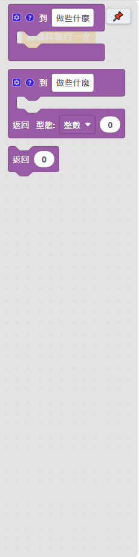
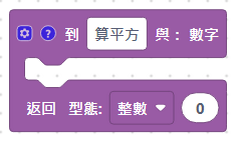
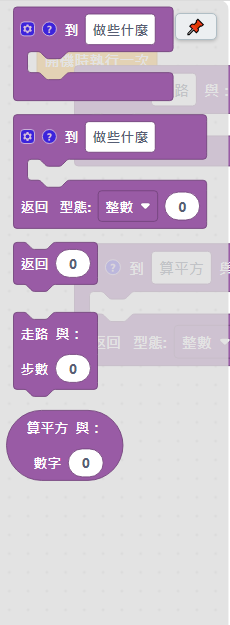

# 4.11 副程式

副程式（也叫「函式」「function」）是把一段常常重複用到的積木包成一個有名字的「功能包」，之後要用的時候直接呼叫這個名字，不用每次都重新排一次積木。

積木箱裡有三個基本模板：「到 做些什麼」（沒有回傳值）、「到 做些什麼／返回 型態：整數」（有回傳值）、還有一顆單獨的「返回」積木。

## 建立副程式

| 積木 | 說明 |
|---|---|
| 到 ＿ （沒有回傳值） | 建立一個副程式，取一個名字（例如「走路」）。點左上角齒輪 ⚙️ 可以增加參數（要傳進去的數字／文字）。 |
| 到 ＿ ／返回 型態：＿ （有回傳值） | 建立一個會回傳一個結果的副程式，例如算完之後回傳一個數字。回傳型態可以選整數、小數、文字、是非。 |

### 沒有回傳值的副程式（例如「走路」，帶一個參數「步數」）

### 有回傳值的副程式（例如「算平方」，帶參數「數字」，回傳整數）

## 加參數（點齒輪 ⚙️）

點副程式積木左上角的齒輪，可以拖曳「加一個參數」進來，取名字（例如「步數」「數字」）。加好之後，副程式標題會多出「與：參數名稱」，副程式裡面就能用這個參數名稱當一顆積木讀取傳進來的值。

## 返回積木

| 積木 | 說明 |
|---|---|
| 返回 ＿ | 結束這個副程式，並且把後面接的值當作結果傳回去。**只能放在「有回傳值」的副程式裡面**；後面接的積木型態要跟副程式宣告的回傳型態一致（整數、小數、文字、是非），軟體會自動幫忙掛上對應型態的預設值。 |

> 💡 如果要「條件成立才返回」，外面包一顆[如果積木](01-控制.md)就好，不用另外找帶條件的返回積木——這個軟體刻意把「返回」簡化成只有值、沒有內建條件判斷，跟大家已經熟悉的「如果」積木分開，比較不容易搞混。

## 呼叫副程式

副程式建立好之後，積木箱的「副程式」分類裡會自動多出可以呼叫它的積木：

呼叫的時候，把要傳進去的參數值接在後面（例如「走路 與：步數 [10]」）；如果是有回傳值的副程式，呼叫積木會變成可以接在其他積木「＿」空格裡的長條形狀，代表它會傳回一個值可以直接拿來用（例如接在「序列埠印出」後面直接印出計算結果）。

## 副程式專用變數／陣列

如果副程式裡面需要一個「只有自己看得到、不會跟其他副程式或主程式的同名變數搞混」的變數，可以用[變數類](07-變數.md)的「宣告副程式專用的變數」，或[陣列類](08-陣列.md)的「宣告副程式專用的陣列」，勾選「記住上次的值」還能讓副程式記得上次執行到哪裡。

---
上一步：[4.10 儲存類](10-儲存.md)　｜　下一步：[4.12 C 語言類](12-C語言.md)
