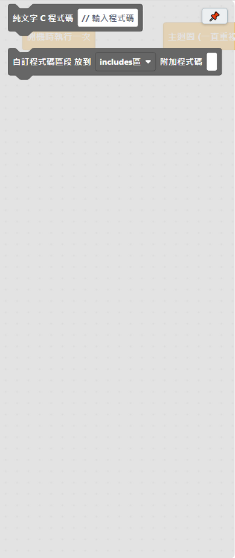

# 4.12 C 語言類

給比較進階的使用者用的「逃生門」：想寫的東西積木剛好沒有對應的，可以直接打 C++ 程式碼。**一般教學用不太會用到這個分類，跳過也沒關係**。

| 積木 | 說明 |
|---|---|
| 純文字 C 程式碼 ＿ | 直接輸入純文字 C++ 程式碼。這會和它所在的區塊一起執行。 |
| 自訂程式碼區段 放到 ＿ 附加程式碼 ＿ | 這個框框內的文字，會被抽離並放到指定的 C++ 程式碼區段（includes 區／defines 區／globals 區／functions 區）。 |

## 什麼時候會用到

- 用到某個積木庫沒包進來的函式庫，需要自己寫 `#include`（放到「includes 區」）。
- 需要定義一個積木沒有對應介面的全域變數或巨集（放到「defines 區」或「globals 區」）。
- 想直接貼一段查到的範例 C++ 程式碼，暫時不想拆成積木。

## 小提醒

這個分類是給**看得懂 C++ 語法**的使用者用的進階工具，打錯字或語法錯誤不會有積木那種「接不上去」的防呆，編譯時才會發現錯誤（可以在[程式碼預覽](../02-軟體介面導覽/04-程式碼預覽.md)先檢查產生出來的完整程式碼）。一般教學情境幾乎用不到這一類積木，前面 11 類積木已經涵蓋國小機器人課程需要的絕大部分功能。

---
上一步：[4.11 副程式](11-副程式.md)　｜　回到：[積木字典總覽](README.md)
