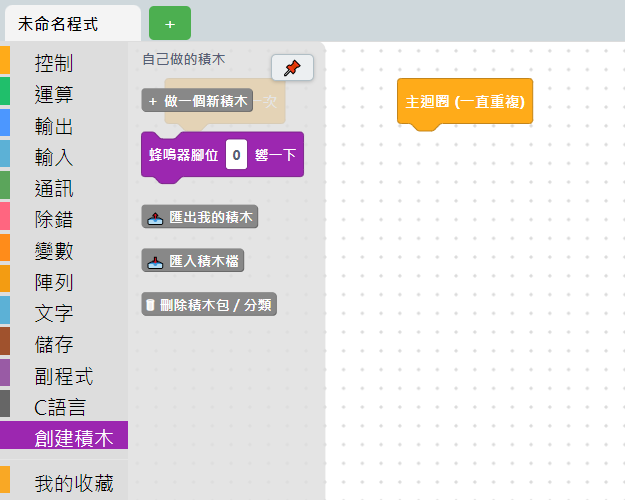
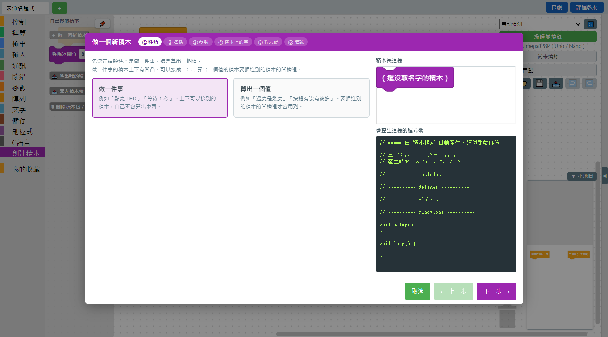
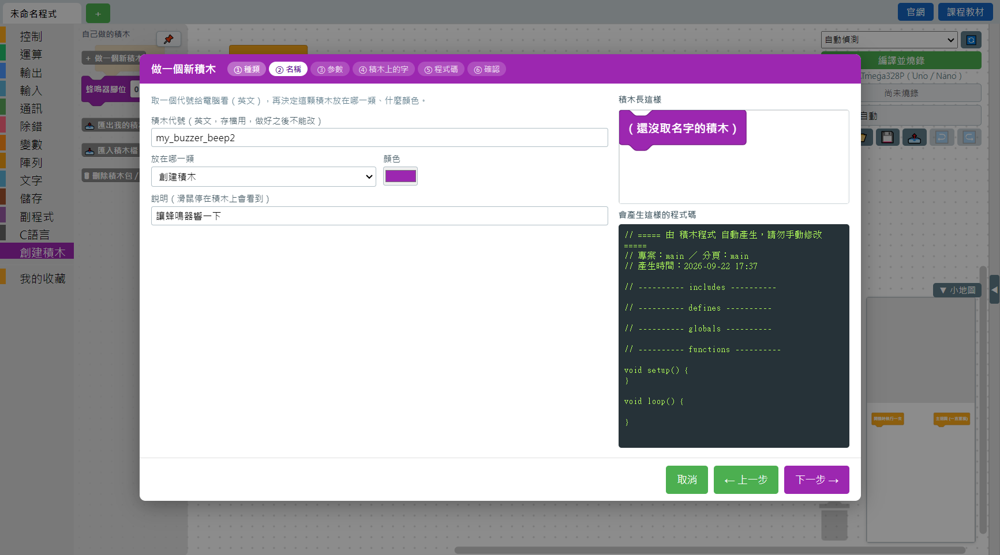
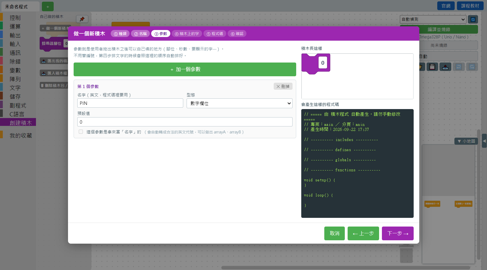
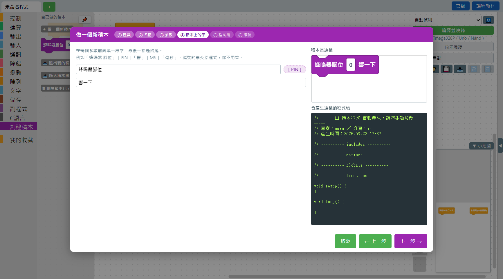
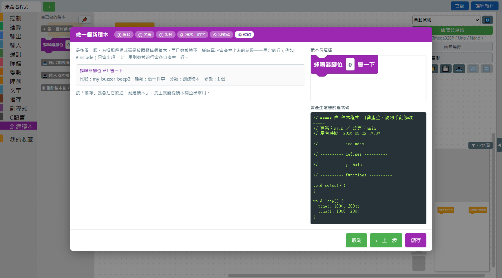
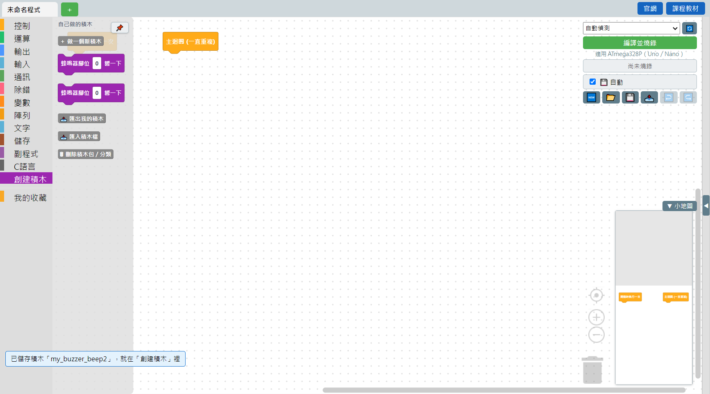

# 5.2 六步做出一顆積木

以下用「做一顆蜂鳴器叫一下的積木」當例子，完整走一遍六個步驟。

## 開始：積木箱最下面的「創建積木」分類

積木分類欄最下面有一個「創建積木」分類，點開會看到：



- **＋ 做一個新積木**——開始六步精靈，本頁主要在講這個。
- **匯出我的積木**／**匯入積木檔**——見 [5.4 積木包管理](04-積木包管理匯出與匯入.md)。
- **刪除積木包／分類**——見 [5.3 修改與刪除自製積木](03-修改與刪除自製積木.md)。

按下「＋ 做一個新積木」，就會打開六步精靈視窗。畫面右邊全程都看得到「積木長這樣」的即時預覽，跟「會產生這樣的程式碼」的程式碼預覽——邊填表單邊看結果，不用等到最後才知道做出來是什麼樣子。

## ① 種類：做一件事，還是算出一個值



- **做一件事**：積木上下有凹凸、可以接成一串，例如「點亮 LED」「等待 1 秒」。這次範例（蜂鳴器叫一下）就屬於這種。
- **算出一個值**：積木要插進別的積木的凹槽裡才有用，例如「溫度是幾度」。選這個的話還要多選「算出來的是什麼」（數字／是非／文字）。

## ② 名稱：代號、分類、顏色、說明



| 欄位 | 說明 |
|---|---|
| 積木代號 | 給電腦看的英文代號，**存檔用的鍵值，做好之後不能改**，只能用英文字母、數字、底線，不能用數字開頭。 |
| 放在哪一類 | 預設是「創建積木」，下拉選單最後一項「＋ 新增分類…」可以現場開一個新分類（例如「感測器」），選了之後名稱、顏色會另外跳出一個小表單。 |
| 顏色 | 積木的底色，純粹外觀，不影響功能。 |
| 說明 | 滑鼠停在積木上會看到的提示文字，建議寫清楚這顆積木實際會做什麼。 |

## ③ 參數：使用者可以自己填的地方



按「＋ 加一個參數」新增一個參數卡片，每個參數要填：

- **名字**（英文，程式碼裡要用，例如 `PIN`）
- **型態**：數字欄位／值插槽（可以插別的積木）／下拉選單／文字欄位
- 依型態不同，還會有「可以插什麼型態的積木」「預設值」「選單裡有哪些選項」等對應欄位

不用管參數出現的順序編號，下一步排文字的時候會照這裡新增的順序自動排好。

## ④ 積木上的字：排版



在每個參數**前面**填一段文字，最後一格是結尾。例如範例做的是「蜂鳴器腳位 ［PIN］ 響一下」——「蜂鳴器腳位」在參數前面、「響一下」是結尾。右邊的積木預覽會即時顯示排版結果。

## ⑤ 程式碼：真正要產生的 C++


**主要程式碼**是這顆積木本身會產生的那一行，把游標放進輸入框、按下面的參數藥丸鈕（例如 `PIN`），就會把參數代碼插進游標位置。範例填的是：

```
tone({PIN}, 1000, 200);
```

下面還有幾個可以展開的區塊，對應 C++ 程式檔案裡不同的位置，**只在真的需要時才填**：

| 區塊 | 對應位置 | 什麼時候要填 |
|---|---|---|
| 要用到的函式庫（include 區） | `#include` | 這顆積木要用到某個 Arduino 函式庫時（一行一個函式庫名稱） |
| 常數定義（define 區） | `#define` | 需要定義巨集常數時 |
| 全域變數／物件（全域區） | 檔案最上方的全域宣告 | 需要建立函式庫的物件（例如 `Servo myServo;`）時 |
| 開機時要做的設定（setup 區） | `void setup()` 裡面 | 需要初始化（例如 `myServo.attach(9);`）時 |

函式庫要放的資料夾位置、「打開這個資料夾」按鈕也在這一步顯示，方便直接把廠商給的 `.h`／`.cpp` 檔案丟進去。

## ⑥ 確認：存檔前最後看一眼



顯示這顆積木的完整摘要（訊息、代號、種類、分類、參數個數），右邊的程式碼預覽會示範**放兩顆這個積木、而且參數填不一樣**時真正會產生出來的結果——固定的行（例如 `#include`）只會出現一次，用到參數的行會各自產生一行。確認沒問題就按「儲存」。

## 存檔完成



跳出「已儲存積木『代號』，就在『分類』裡」的提示，積木箱馬上就能看到新積木、直接拖出來用，不用重開軟體。

---
上一步：[5.1 為什麼要自己做積木](01-為什麼要自己做積木.md)　｜　下一步：[5.3 修改與刪除自製積木](03-修改與刪除自製積木.md)
