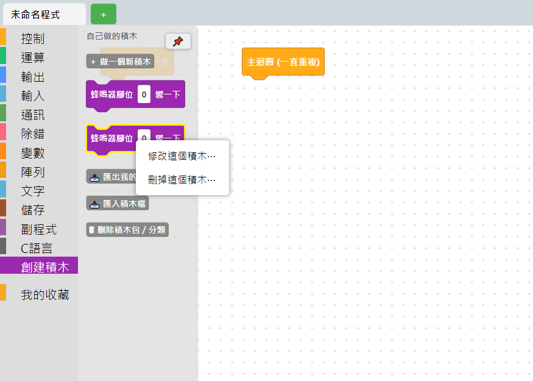
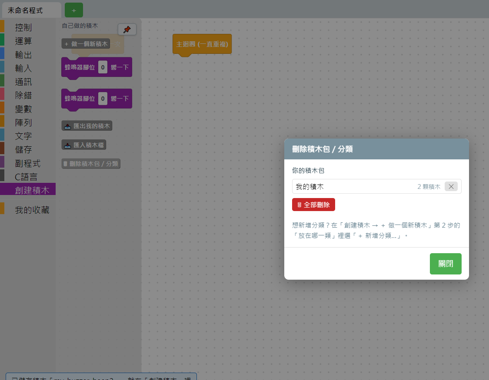

# 5.3 修改與刪除自製積木

## 改單一顆積木

在積木箱裡（不是畫布上）自製積木的圖示上按右鍵：

- **修改這個積木…**——重新打開六步精靈，帶入原本填過的內容，可以逐步修改。**積木代號改不了**（那是存檔用的鍵值），其他欄位都能改。存檔後，畫布上已經用到這顆積木的地方會一起套用新的樣子跟程式碼邏輯。
- **刪掉這個積木…**——整顆刪除。如果目前畫布（編輯區）還有地方在用這顆積木，會先擋下來提醒你「要先把編輯區裡的那幾顆刪掉，才能刪掉這個積木」，避免刪掉之後留下無法辨識的殘缺積木。

> 💡 畫布上的積木（不是積木箱裡的）按右鍵沒有「修改」以外的自製積木專屬選項，只有一般積木都有的[右鍵選單](../03-積木操作技巧/09-整理積木與右鍵選單.md)。

## 整包刪除：積木包與分類管理

積木箱「創建積木」分類裡的「🗑 刪除積木包／分類」按鈕，會打開管理視窗：

- **你的積木包**：列出目前有哪些積木包（例如預設的「我的積木」），旁邊顯示裡面有幾顆積木，可以整包按 ✕ 刪除，或按「🗑 全部刪除」清空。
- **你開的分類**：如果自己開過新分類（見 [5.2](02-六步做出一顆積木.md) 第 2 步），這裡可以刪掉。**分類本身不會存進積木包裡**，是分開存的，所以就算清空積木包，自己開的分類還是會留著，除非另外刪除。

## 小提醒

- 刪除是不能復原的操作，刪之前請確認清楚。
- 這裡看到的「積木包」跟[匯出／匯入](04-積木包管理匯出與匯入.md)講的是同一份東西——匯出的時候就是把這個清單裡的積木包打包成檔案。

---
上一步：[5.2 六步做出一顆積木](02-六步做出一顆積木.md)　｜　下一步：[5.4 積木包管理：匯出與匯入](04-積木包管理匯出與匯入.md)
