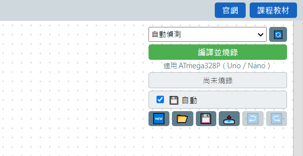

# 6.1 連接埠選擇：自動偵測 vs 手動選

工具列上這個下拉選單，決定燒錄的時候要透過哪一個 USB 連接埠：

## 自動偵測（預設、建議一般情況都用這個）

下拉選單預設選在「自動偵測」，軟體會自己去找電腦上有哪些看起來像 Arduino 板子的連接埠——只有「arduino-cli 認得型號」或「有 USB vendor ID」的裝置才會被當成候選，藍牙虛擬序列埠（常見於 COM6、COM7 這種號碼）因為沒有 USB vendor ID，會被自動排除，不會誤選到。

多數情況下不用手動選，插上板子、按「編譯並燒錄」就好。

## 什麼時候要手動選

- 電腦同時接了好幾個 USB 裝置（例如板子以外還接了滑鼠轉接器、讀卡機），自動偵測選錯的時候。
- 自動偵測找不到板子，但你確定板子已經接上、也裝好驅動了（見 [6.2 找不到板子的三步驟排查](02-找不到板子的三步驟排查.md)）。

手動選的做法：點開下拉選單，選單裡除了「自動偵測」，還會列出電腦目前偵測到的實際連接埠（例如 COM3、COM5），直接點選要用的那一個。選單右邊的 🔄 按鈕可以重新掃描一次，插拔板子之後如果選單沒更新，按一下這顆就會重新整理清單。

⚠️ 原生下拉選單這裡展開時是作業系統畫的視窗，跟網頁本身的截圖方式不同，所以這裡沒有放「展開後」的截圖——實際操作時用滑鼠點一下就會看到清單。

---
上一步：[燒錄與疑難排解總覽](README.md)　｜　下一步：[6.2 找不到板子的三步驟排查](02-找不到板子的三步驟排查.md)
