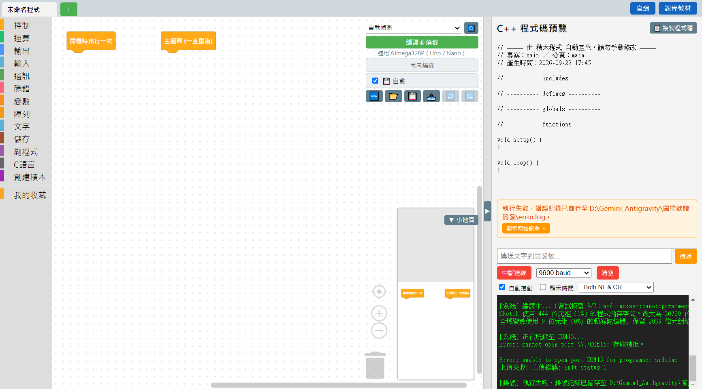

# 6.2 找不到板子的三步驟排查

按下「編譯並燒錄」之後，如果軟體找不到板子、或是連上了卻燒不進去，畫面下方會出現紅字的錯誤說明，例如：

錯誤畫面固定會有：一句白話的錯誤說明、一個「錯誤紀錄已儲存至...error.log」的提示（技術細節都存在這個檔案裡，回報問題時可以附上）、還有「顯示原始訊息」可以展開看更詳細的技術訊息（見 [6.5 看懂編譯錯誤](05-看懂編譯錯誤.md)）。

## 三步驟排查

### 第一步：確認實體連接

1. 檢查 USB 傳輸線兩端有沒有插到底（電腦這端、板子這端都要插好）。
2. 換一條傳輸線試試看——**有些傳輸線只能充電、不能傳資料**，外觀看起來一樣，是最容易忽略的原因。
3. 換電腦上的另一個 USB 孔試試看。

### 第二步：讓軟體重新掃描

插好之後，按連接埠下拉選單旁邊的 🔄「重新整理」按鈕，看看下拉選單裡有沒有出現板子（見 [6.1 連接埠選擇](01-連接埠選擇.md)）。如果出現了但不是自動選到的那個，手動點選它再重新按「編譯並燒錄」。

### 第三步：檢查驅動程式

如果換線、換孔、重新整理都沒用，很可能是這台電腦**還沒有裝這片板子需要的 USB 驅動程式**——尤其是第一次用某片板子的時候最常見。這種情況下，軟體通常會在錯誤畫面上直接顯示一個「安裝 USB 驅動程式」的按鈕，點下去可以直接跳到安裝流程；也可以照 [6.4 USB 驅動安裝](04-USB驅動安裝.md) 的說明手動安裝。

## 特殊情況：連接埠被其他程式占用

如果錯誤訊息裡看到類似「存取被拒」「cannot open port」的字樣，通常代表這個連接埠正被**別的程式占用**——最常見的是序列埠監控視窗、或另一套燒錄軟體（例如 Arduino IDE）還開著連著同一個埠。關掉其他可能占用連接埠的程式，或是先按一下[序列埠監控](../02-軟體介面導覽/05-序列埠監控.md)的「中斷連線」再重新燒錄。

---
上一步：[6.1 連接埠選擇](01-連接埠選擇.md)　｜　下一步：[6.3 圖解引導畫面說明](03-圖解引導畫面說明.md)
