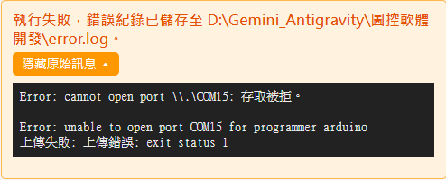

# 6.5 看懂編譯錯誤

積木排得有問題（通常發生在[自己做的積木](../05-自己做積木/README.md)裡填了不合法的程式碼），編譯這一步就會失敗，畫面下方會出現錯誤說明：

## 錯誤說明的三個部分

1. **白話的錯誤說明**（橘色文字）：盡量用一般人看得懂的話講失敗原因跟建議動作。
2. **錯誤紀錄已存檔的提示**：完整的技術細節都存進 `error.log`（存在專案資料夾旁邊），回報問題給別人看的時候可以附上這個檔案。
3. **顯示原始訊息**：點下去可以展開最原始的編譯器／燒錄工具輸出，上面截圖展開的內容就是這樣，通常是英文夾雜檔名、行號的技術訊息。

## 一般老師看不懂原始訊息也沒關係

原始訊息是給比較懂技術的人（或回報給開發者）用的，一般使用情境下，**看橘色的白話說明、照著建議動作做就好**。如果白話說明沒辦法解決，可以把「顯示原始訊息」展開後的內容截圖或複製起來，附在問題回報裡。

## 常見會導致編譯失敗的原因

| 情況 | 說明 |
|---|---|
| 自製積木的程式碼打錯字 | 例如少打一個分號、括號沒對齊。回去[修改這顆積木](../05-自己做積木/03-修改與刪除自製積木.md)，檢查第 5 步填的程式碼 |
| 用到函式庫但沒放對資料夾 | 函式庫要放在[指定的 libraries 資料夾](../05-自己做積木/04-積木包管理匯出與匯入.md)，路徑或檔名打錯也會找不到 |
| 連接埠被其他程式占用 | 這種是**燒錄**（上傳）階段失敗，不是編譯階段——編譯本身其實成功了，只是燒不進板子，處理方式見 [6.2](02-找不到板子的三步驟排查.md) |

---
上一步：[6.4 USB 驅動安裝](04-USB驅動安裝.md)　｜　下一步：[6.6 Flash／RAM 用量條是什麼意思](06-FlashRAM用量條.md)
